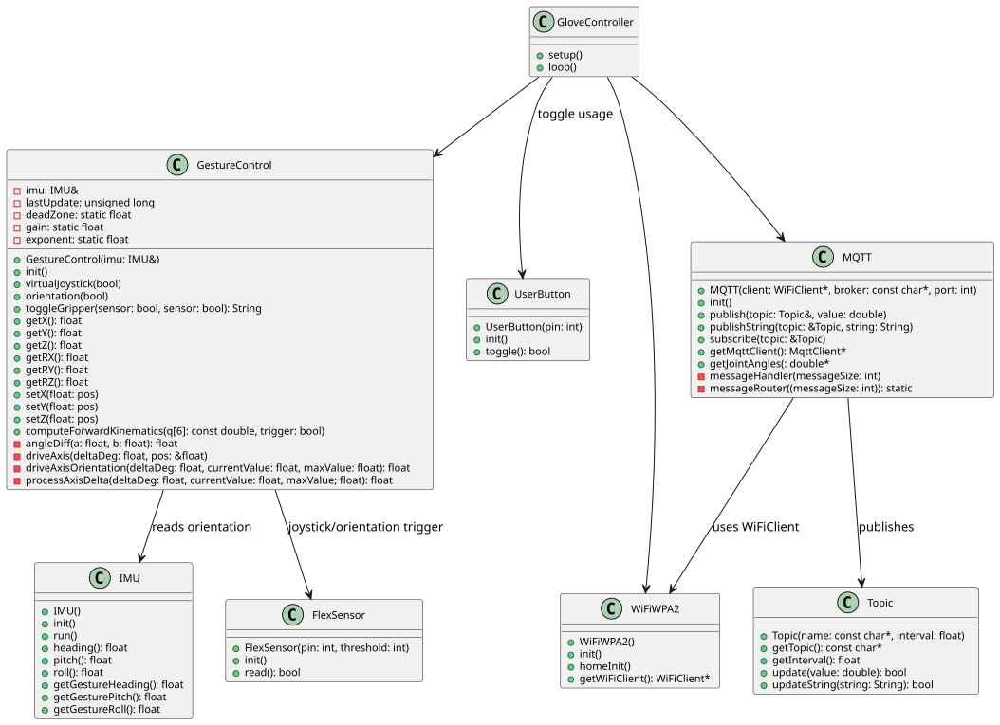

# AIS2104 Industrielle styrsystemer Project

This repository contains the code and configuration for the AIS2104 Industrielle styrsystemer project. The project is 
built using [PlatformIO](https://platformio.org/) and the Arduino framework for the ESP32 (Arduino Nano ESP32 board). 
This project takes use of the 9-DoF IMU (Inertial Measurement Unit) to track the orientation of the hand, and a way of 
creating a "Virtual Joystick" to control manipulate a 6-DoF Robot Arm. It uses flex sensors to toggle tracking of the 
virtual joystick and orientation, and publishes it via MQTT to a broker. 

## Table of Contents
- [Overview](#overview)
- [Installation](#installation)
- [System Architecture](#system-architecture-diagram-uml)


## Overview

This project is for controlling A UR5e robot via MQTT, I have provided a detailed description on how to initialize this project!

## Installation

### Prerequisites
- **PlatformIO:** Install PlatformIO IDE or the PlatformIO Core.
    - For the CLion, follow the instructions [here](https://docs.platformio.org/en/latest/core/installation.html).

### Clone the Repository

1. Open your terminal.
2. Clone the repository by running:

```bash
git clone git@github.com:HermanGran/Master-of-Machines.git
```

### PlatformIO setup
To compile and build the project, run the following:

 ```bash
pio init --ide clion
```

Then run

```bash
pio run
```

To open the serial monitor, run:

```bash
pio device monitor 
```

## System Architecture Diagram (UML)

The figure below describes the system architecture of the glove, generated by plantuml
package. Throughout the code is also doxygen commenting style used, to generate 
a doxygen documentation.

